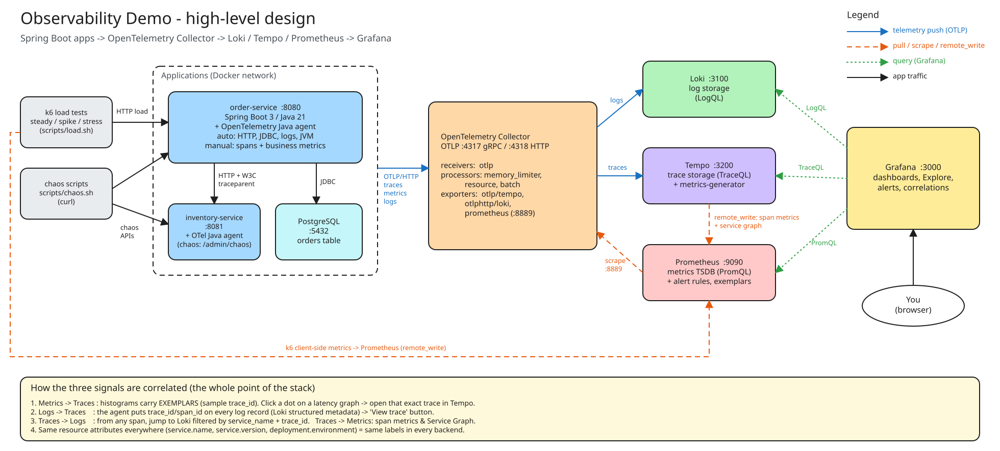
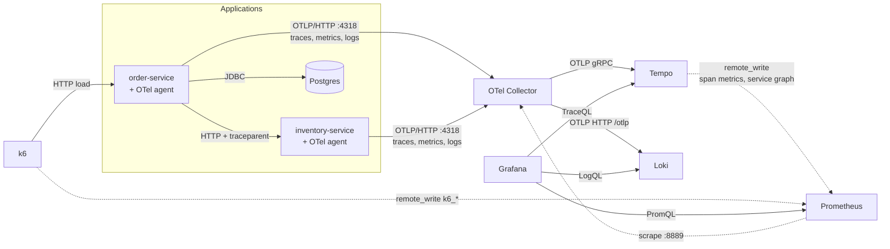
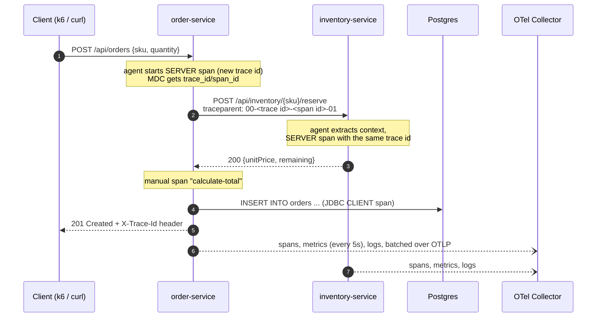

# Architecture

> The editable source is [`architecture.excalidraw`](architecture.excalidraw): open https://excalidraw.com
> → *Open* (or drag & drop the file). The SVG above is a static rendering of it.

## Components

| Component | Image / tech | Port(s) | Role |
|-----------|--------------|---------|------|
| order-service | Spring Boot 3.3, Java 21, OTel Java agent 2.10 | 8080 | Orders API, Postgres, calls inventory-service, chaos endpoints |
| inventory-service | Spring Boot 3.3, Java 21, OTel Java agent 2.10 | 8081 | In-memory stock, runtime-configurable fault injection |
| postgres | `postgres:16-alpine` | 5432 | Orders storage (gives us DB spans and a connection pool to saturate) |
| otel-collector | `otel/opentelemetry-collector-contrib:0.115.1` | 4317, 4318, 8888, 8889, 13133, 55679 | Receives all OTLP telemetry, routes each signal to its backend |
| prometheus | `prom/prometheus:v2.55.1` | 9090 | Metrics storage, PromQL, alert rules, exemplar storage, remote-write receiver |
| loki | `grafana/loki:3.3.2` | 3100 | Log storage with native OTLP ingestion |
| tempo | `grafana/tempo:2.6.1` | 3200 | Trace storage + metrics-generator (span metrics & service graph) |
| grafana | `grafana/grafana:11.4.0` | 3000 | Dashboards, Explore, correlations (anonymous admin login) |
| k6 | `grafana/k6:0.55.0` | n/a | Load generator, only runs on demand (`scripts/load.sh`) |

## How each signal flows

| Signal | Produced by | Path | Ends up as |
|--------|-------------|------|-----------|
| Traces | Agent auto-instrumentation (Spring MVC, HttpURLConnection, JDBC, @Scheduled) + manual `calculate-total` span | app → OTLP → collector → `otlp/tempo` → Tempo | Traces in Tempo; Tempo also derives `traces_spanmetrics_*` and `traces_service_graph_*` → Prometheus |
| Metrics | Agent (HTTP server/client, JVM, Hikari pool) + custom OTel API metrics | app → OTLP (every 5 s) → collector → `prometheus` exporter `:8889` ← Prometheus scrape (10 s) | `http_server_request_duration_seconds_*`, `jvm_*`, `db_client_connections_*`, `orders_created_total`, ... |
| Logs | Logback events captured by the agent (with trace context) | app → OTLP → collector → `otlphttp/loki` → Loki | Streams labelled `service_name`, ...; `trace_id`, `span_id`, `severity_text` as structured metadata |

The apps *also* print logs to stdout (with `trace_id=` in the pattern), so `docker compose logs order-service` stays useful.

## Life of a request

## Design decisions

**Why the Java agent instead of Micrometer / SDK code?**
Zero code changes: HTTP, JDBC, logging and JVM telemetry appear just by adding `-javaagent`. This is how most
companies roll OTel out to many existing services. Manual instrumentation is still shown (`OrderService`)
via the OTel *API*, which the agent implements at runtime. Spring's native Micrometer path is a stretch goal.

**Why a Collector in the middle?**
Apps only know one endpoint (`otel-collector:4318`) and one protocol (OTLP). Backends can be swapped,
data can be enriched (`resource` processor), batched, sampled or filtered, and memory is protected
(`memory_limiter`), all without redeploying apps. This is the recommended production pattern.

**Why Prometheus scrapes the collector (pull) instead of the collector pushing?**
It is the classic Prometheus model, and it shows both worlds: apps *push* OTLP, Prometheus *pulls*.
(Alternatives: `prometheusremotewrite` exporter, or Prometheus' native OTLP receiver.)

**Why does Tempo write metrics into Prometheus?**
The metrics-generator turns traces into RED metrics and a service dependency graph. That's useful when
some services aren't emitting metrics, and it powers Grafana's Service Graph.

**Why OTLP straight into Loki instead of Promtail/Alloy tailing files?**
No log parsing needed. The trace context and severity arrive as structured fields. The trade-off: logs
depend on the agent; if the app crashes before flushing, the last lines are only in stdout.

**Why so many failure modes in one demo?**
Each one has a distinct "telemetry fingerprint" (see [SCENARIOS.md](SCENARIOS.md)). Recognizing those
fingerprints quickly is the core skill of the job.

## OTel → Prometheus naming

The collector's `prometheus` exporter translates names:

| OTel metric (unit) | Prometheus series |
|--------------------|-------------------|
| `http.server.request.duration` (s) | `http_server_request_duration_seconds_bucket/_sum/_count` |
| `http.client.request.duration` (s) | `http_client_request_duration_seconds_*` |
| `jvm.memory.used` (By) | `jvm_memory_used_bytes` |
| `jvm.thread.count` ({thread}) | `jvm_thread_count` |
| `jvm.cpu.recent_utilization` (1) | `jvm_cpu_recent_utilization_ratio` |
| `db.client.connections.usage` | `db_client_connections_usage` |
| `orders.created` ({order}, counter) | `orders_created_total` |
| `order.amount` (histogram) | `order_amount_bucket/_sum/_count` |
| `inventory.stock.level` ({item}) | `inventory_stock_level` |
| `chaos.memory.held` (By) | `chaos_memory_held_bytes` |

Attributes become labels with dots replaced: `http.route` → `http_route`, `service.name` → `service_name`.

## Production differences (what this demo simplifies)

- Single-binary Loki/Tempo on local disk → object storage (S3/GCS) + scalable deployment modes.
- 100% trace sampling → head or tail sampling.
- Anonymous admin Grafana → SSO, RBAC.
- No Alertmanager → alert routing, on-call integration.
- Collector as a single container → agent (per node/sidecar) + gateway tiers.
- Prometheus → Mimir/Thanos/Cortex for HA and long-term storage.
